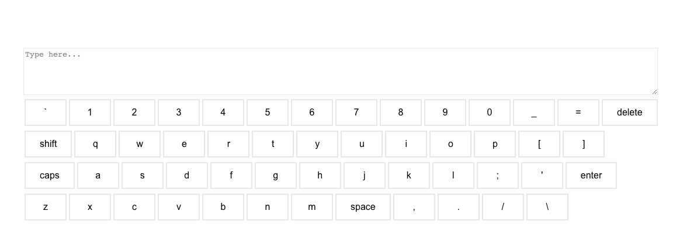

# Virtual Keyboard

This project is focused on creating a fully functional virtual keyboard using ReactJs. The keyboard contains numbers, special characters and alphabets along with space, delete, enter, shift and caps lock keys.

One of unique feature of the keyboard is that it rearranges itself randomly after any non-functional key is hit say number, special characters or alphabets.
This type of keyboard can be used to detect a robot. 

Some the examples where we can use such keyboard:
- Instead of CAPTCHA we can provide this keyboard for adding a specific keyword in the textbox.
- In bank website/mobile where there is a need to add password/pin.

This project is deployed on [App engine](https://virtual-keyboard-314314.el.r.appspot.com/)

## Install dependencies

### `npm install`
To install dependencies defined in `package.json`.

### `npm start`
Runs the app in the development mode.\
Open [http://localhost:3000](http://localhost:3000) to view it in the browser.

The page will reload if you make edits.\
You will also see any lint errors in the console.
